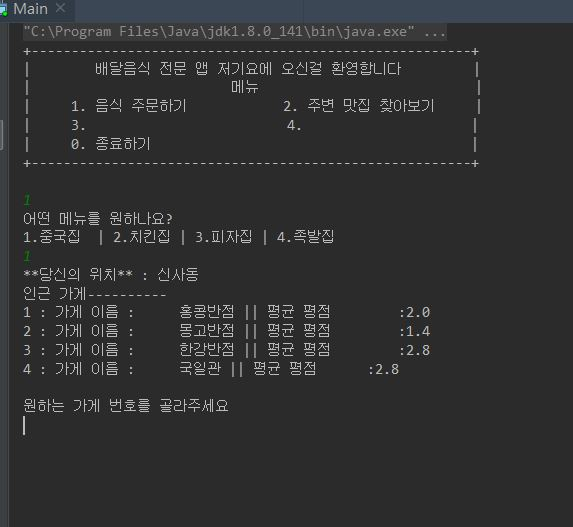
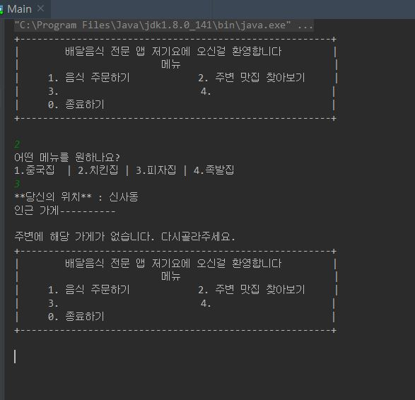
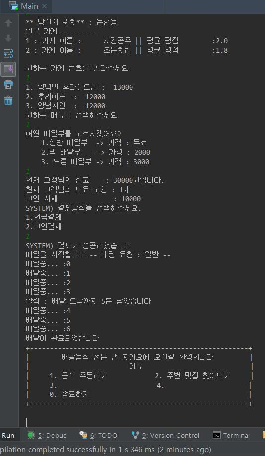

team-oop
======================

소스 보는 방법
> src
>> main
>>> 소스
>>> 1. account : 계좌와 관련된 자바파일을 모아둔 폴더
>>> 2. client  : 고객과 관련된 자바파일을 모아둔 폴더
>>> 3. store   : 가게와 관려된 자바파일을 모아둔 폴더
>>> 4. App.java   : 어플리케이션 클래스
>>> 5. Main.java  : 실행부

현재 예상 메인화면
--------------------------------------------------
1. 주변에 상점이 있을 때 
--------------------------------------------------

--------------------------------------------------
2. 주변에 상점이 없을 때

----------------------------------------------------
3. 예상 결제 시나리오 -- 추후 수정 가능성 있음

